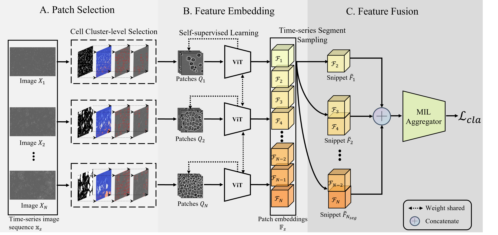

# CLANet: A Comprehensive Framework for Cross-Batch Cell Line Identification Using Brightfield Images.
CLANet is a pioneering framework for cross-batch cell line identification using brightfield images, specifically designed to tackle three distinct batch effects. The framework comprises three stages: (1) extracting significant cell patches from the time-series image sequence; (2) self-supervised learning to learn and extract feature embeddings from the extracted patches; (3) feature fusion using the MIL aggregator for predicting cell line identity.

<!-- ## Introduction -->
<div align="center">
  
</div><br/>

A time-series cell image sequence $\mathbb{X}\_{s}$ is obtained from a single microscopy location within a flask. Each cell image $X\_{n}$ undergoes the Cell Cluster-level Selection to generate patches $Q\_{n}$. Patch embeddings are extracted from patches using self-supervised learning, forming the patch embedding sequence $\mathbb{F}\_{s}$. During training, the Time-series Segment Sampling is applied to sample the patch embedding sequence into several snippets, which are then fed into a multiple instance learning (MIL) aggregator to compute the classification loss $\mathcal{L}\_{cla}$. During the inference stage, the complete embedding sequence is directly passed into the MIL aggregator to obtain the predicted label.

## Preparation
This implementation is built upon pytorch==1.8.1+cuda111, the environment can be configured:
```
pip install -r requirements.txt
```
## Dataset
The Dataset is currently undergoing internal ethical checking at AstraZeneca company and will be published soon.
* After the data preparation, you will find the following directory structure:  
  ```
  Cell_lines
  ├── A427 (cell line name)
  ├── A549
  │   ├── batch_1
  │     ├── cell_image1.png
  │     ├── cell_image2.png
  │     ├── ...
  │   ├── batch_2
  │   ├── ...
  ├── ...
  ```
Each cell image in the dataset follows a naming convention such as "VID1709_G7_1_02d12h00m.jpg". Here, "VID1709" represents the index of the biological experiments (not relevant to this work), "G7" indicates the flask position that helps us split samples into sequences (or bags) in MIL (Multiple Instance Learning), "1" is the flask ID (not used), and "02d12h00m" denotes the incubation timepoint. This timepoint means that the image was collected on the 2nd day, 12 hours, and 00 minutes.

## Train & inference
The patch selection stage includes generating binary masks and cell cluster-level selection. 
* Generate binary Masks for cell images
```
pip install -r requirements.txt
```
* Cell cluster-level selection
## Visualize


## Main Results  


## Acknowledgement
Many thanks to the authors of [dino](https://github.com/facebookresearch/dino), [SelectiveSearch](https://github.com/AlpacaTechJP/selectivesearch) and [AttentionDeepMIL](https://github.com/AMLab-Amsterdam/AttentionDeepMIL/blob/master/model.py).


## Citation
If you find this project useful for your research, please consider citing: 
```bibtex   

```

## Contact
If you have any questions, feel free to open an issue or contact us at lt228@leicester.ac.uk.
