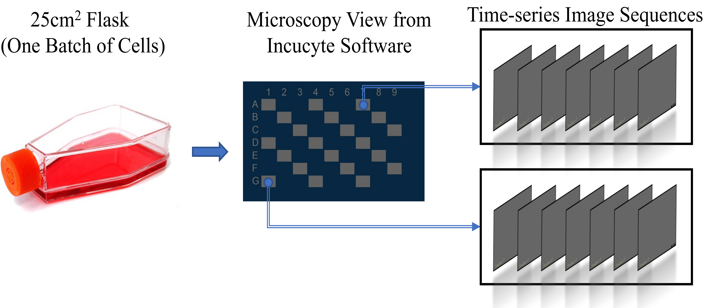

# AstraZeneca Global Cell Bank Brightfield Image Dataset 
## Background 
Cell line authentication is a critical aspect of biomedical research to ensure accurate and reliable results. Traditional methods, such as short tandem repeat (STR) analysis, have limitations due to their cost and time requirements. In recent years, deep neural networks and computer vision techniques have shown great promise in cost-effective cellular image analysis. However, the lack of centralized datasets raises questions about whether cell image classification can replace or support cell line authentication. Considering the advantages of brightfield imaging, including simplified setup, the ability to track cell genealogies in long-term experiments, and its low cost, we aim to automate the cell line authentication process using deep learning and computer vision techniques based on brightfield cell images.

## Dataset Description 
To facilitate our research, we have curated a dataset consisting of sample images from the registered cell lines in the AstraZeneca Global Cell Bank (AZGCB). Our focus primarily centers around commonly used cancer cell lines, selected based on the frequency of requests for these cell lines. The dataset includes brightfield images collected during normal cell growth experiments where no compounds or medicines were used. The base medium was supplemented with 10% Fetal Bovine Serum (Sigma) and 1× GlutaMAX (Gibco), unless otherwise specified. Currently, the dataset comprises 187,990 brightfield images from 44 different cell lines across 104 experimental batches, as listed in Table 1.

## Data Collection 
Fig. 1 provides an example of our data collection process. Cells were thawed and seeded into flasks (Corning) at a density of 0.5-2×10^6 cells per flask. The flasks were then placed in the Incucyte S3 system (Essen Bioscience, Sartorius), and brightfield images were captured from various locations within the flask at regular intervals ranging from 1 to 8 hours. This process was conducted over a time period of 3 to 18 days. All images were exported in JPEG format with a size of 1408×1040 (96×96dpi).

### Fig. 1. The workflow of the data collection. Cells are seeded in a 25〖cm〗^2flask. The microscopy view of the flask is captured by the Incucyte software. Time-series image sequences can be exported from different locations (grey areas) across the flask.

  

 

### Table 1.  List of 44 cell lines. All base medium was purchased from Sigma Aldrich, and supplemented with 10% FBS (Sigma Aldrich) and 1x GlutaMAX (Gibco) unless otherwise stated.
|     Cell Line Name    |     Source                        |     Base Medium                                                                                                                                                         |
|-----------------------|-----------------------------------|-------------------------------------------------------------------------------------------------------------------------------------------------------------------------|
|     A427              |     ATCC                          |     EMEM                                                                                                                                                                |
|     A431              |     ATCC                          |     Dulbecco's Modified Eagle Medium                                                                                                                                    |
|     A549              |     ATCC                          |     RPMI 1640                                                                                                                                                           |
|     ASPC1             |     ATCC                          |     RPMI                                                                                                                                                                |
|     BT474             |     ATCC                          |                                                                                                                                                                         |
|     Cama1             |     ATCC                          |     EMEM                                                                                                                                                                |
|        HCC 2279       |     KCLB                          |     Dulbecco's Modified Eagle Medium                                                                                                                                    |
|     HCC1395           |     ATCC                          |     RPMI 1640                                                                                                                                                           |
|     HCC70             |     ATCC                          |     RPMI 1640                                                                                                                                                           |
|     HCC78             |     DSMZ                          |     RPMI 1640                                                                                                                                                           |
|     HCC827            |     ATCC                          |     RPMI 1640                                                                                                                                                           |
|     HCT116            |     ATCC                          |     McCoys 5A                                                                                                                                                           |
|     HEK293            |     ATCC                          |     EMEM                                                                                                                                                                |
|     HELA              |     ATCC?                         |     EMEM                                                                                                                                                                |
|     Hop62             |     NCI                           |     RPMI 1640                                                                                                                                                           |
|     HS-5              |     ATCC                          |     Dulbecco's Modified Eagle Medium                                                                                                                                    |
|     HS578T            |     ECACC                         |     DMEM, 0.01mg/ml Insulin                                                                                                                                             |
|     HT 1080           |     ATCC                          |     Eagle's Minimum Essential Medium, 1%   NEAA                                                                                                                         |
|     KELLY             |     DSMZ                          |     RPMI 1640                                                                                                                                                           |
|     KLE               |     ATCC                          |     DMEM:Hams F12                                                                                                                                                       |
|     KPL4              |     Kawasaki Medical Centre       |     RPMI 1640                                                                                                                                                           |
|     LIM2099           |     ECACC                         |     RPMI, 10uM 1-Thioglycerol, 1ug/ml Hydrocortisone,   0.5ug/ml Insulin                                                                                                |
|     LNCAP             |     ATCC                          |     RPMI 1640                                                                                                                                                           |
|     LU99              |     JCRB                          |     RPMI 1640                                                                                                                                                           |
|     LUHMES            |     ATCC                          |     1:1 Mix of DMEM and Ham's F-12, N2   Supplement 15, bFGF 40 ng/mL                                                                                                   |
|     MCF10A            |     ATCC                          |     DMEM / F-12 (1:1 Mix of DMEM and   Ham's F-12), Horse Serum 5%, Cholera Toxin 0.1 ug/ml, EGF 20 ng/mL, Glutamax   15, Hydrocortisone 0.5 ug/mL, Insulin 10 ug/mL    |
|     MCF7              |     ATCC                          |     EMEM, 1% NEAA                                                                                                                                                       |
|     MDA MB 231        |     ATCC                          |     RPMI 1640                                                                                                                                                           |
|     Mia Paca2         |     ECACC                         |     Dulbecco's Modified Eagle Medium                                                                                                                                    |
|     Min6              |                                   |     DMEM, 50uM 2-Mercaptoethanol                                                                                                                                        |
|     MRC5              |     ECACC                         |     EMEM, 1% NEAA                                                                                                                                                       |
|     NCI H1975         |     ATCC                          |     RPMI 1640                                                                                                                                                           |
|     NCI H1993         |     ATCC                          |     RPMI 1640                                                                                                                                                           |
|     NCI H2030         |     ATCC                          |     RPMI 1640                                                                                                                                                           |
|     NCI H2073         |     ATCC                          |     RPMI 1640                                                                                                                                                           |
|     NCI H2110         |     ATCC                          |     RPMI                                                                                                                                                                |
|     NCI H358          |     ATCC                          |     RPMI 1640                                                                                                                                                           |
|     PC3               |     ATCC                          |     Ham's F12, Kaighn's Modification                                                                                                                                    |
|     SKBR3             |     ATCC                          |                                                                                                                                                                         |
|     SNU1411           |     KCLB                          |     RPMI 1640                                                                                                                                                           |
|     SNU601            |     KCLB                          |     RPMI 1640                                                                                                                                                           |
|     SUM149PT          |     Asterand Bioscience/BioIVT    |     Ham's F12, FBS 5%, Glutamax 1%,   Hydrocortisone 0.5 ug/mL,Insulin 10 ug/mL                                                                                         |
|     T47D              |     ATCC                          |     RPMI 1640                                                                                                                                                           |
|     U2OS              |     ATCC                          |     McCoys 5A                                                                                                                                                           |
